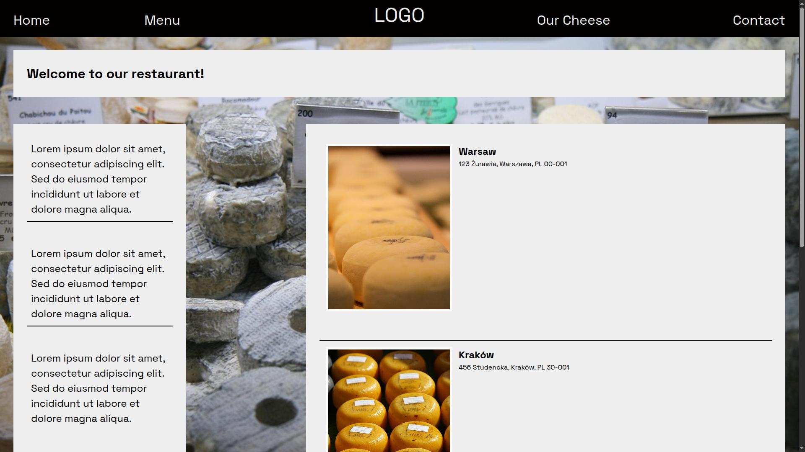
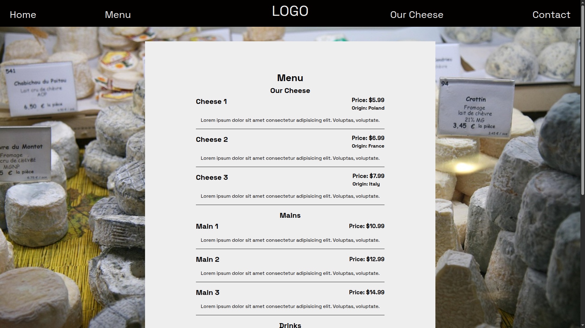
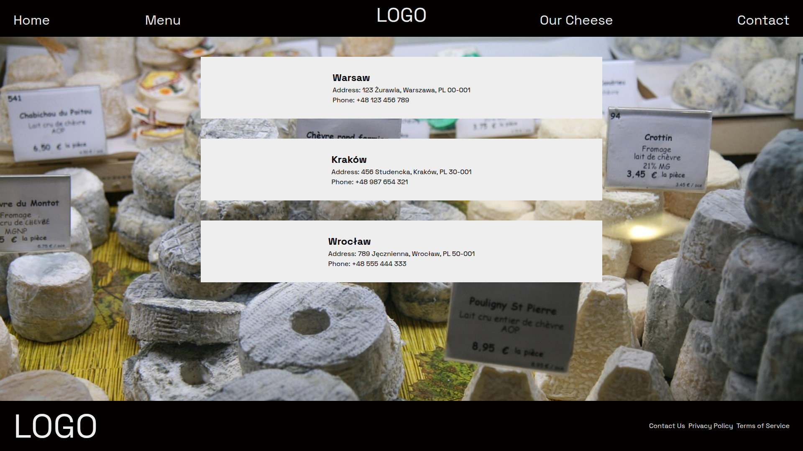

# Restaurant Page

Project created for [Project Odin](https://www.theodinproject.com/lessons/node-path-javascript-restaurant-page)

## Features 

Restaurant page made in vanilla JS using webpack. Layout is created from JS script.

Photos used in this project were sourced from Pixabay under their Content License.

## Live Preview 

To see this website live click this [Link](https://devoid-of-thought.github.io/odin-restaurant-page/)